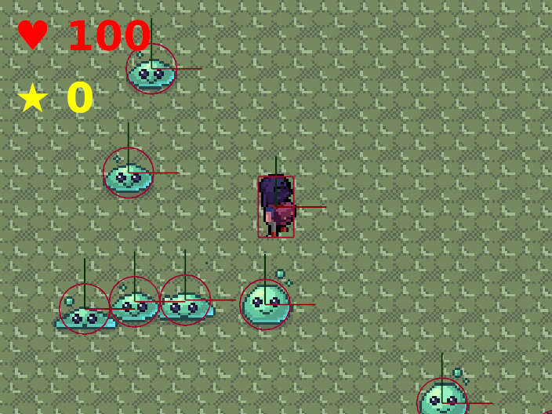

# Bevy 2D top down shooter game example

A simple 2D game made in Bevy.



## Build and run

Make sure you have Rust SDK installed: https://www.rust-lang.org/tools/install

```sh
cargo build --release
target/release/bevy-2d-test
```

## Cross compile for windows

For deb distributions:

```shell
sudo apt install gcc-mingw-w64-x86-64
rustup target add x86_64-pc-windows-gnu
cargo build --release --target x86_64-pc-windows-gnu
```

## Build as web application for itch

Make sure wasm target installed:

```shell
cargo install -f wasm-bindgen-cli

rustup target install wasm32-unknown-unknown
```

Build web-assembly

```shell
cargo build --release --target wasm32-unknown-unknown
wasm-bindgen --no-typescript --out-dir ./out/ --target web ./target/wasm32-unknown-unknown/release/bevy-2d-test.wasm
```

Copy `assets` and `out` to webapp. Zip webapp content and upload to itch.

